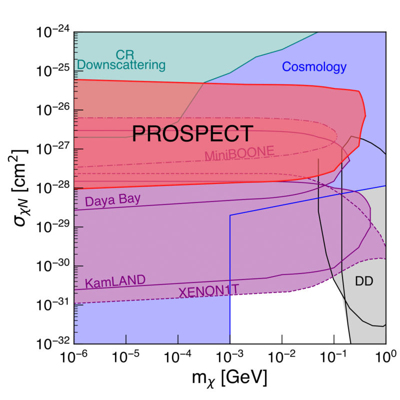

##### Abstract

If dark matter has mass lower than around 1 GeV, it will not impart enough energy to cause detectable nuclear recoils in many direct-detection experiments. However, if dark matter is upscattered to high energy by collisions with cosmic rays, it may be detectable in both direct-detection experiments and neutrino experiments. We report the results of a dedicated search for boosted dark matter upscattered by cosmic rays, using $\sim$14.6 solar days of data from the PROSPECT reactor antineutrino experiment. We show that such a flux of upscattered dark matter would display characteristic diurnal sidereal modulation, and use this to set new experimental constraints on sub-GeV dark matter exhibiting large interaction cross sections.

---

##### Figure 8: 95\% CL exclusion region from PROSPECT data (red) compared to other limits on CR-upscattered DM (purple), CR downscattering (teal), cosmology (blue), and direct detection (gray).



---

##### Citation

```BibTeX
@article{PROSPECT:2021awi,
    author = "Andriamirado, M. and others",
    collaboration = "PROSPECT, (PROSPECT Collaboration)*",
    title = "{Limits on sub-GeV dark matter from the PROSPECT reactor antineutrino experiment}",
    eprint = "2104.11219",
    archivePrefix = "arXiv",
    primaryClass = "hep-ex",
    doi = "10.1103/PhysRevD.104.012009",
    journal = "Phys. Rev. D",
    volume = "104",
    number = "1",
    pages = "012009",
    year = "2021"
}
```