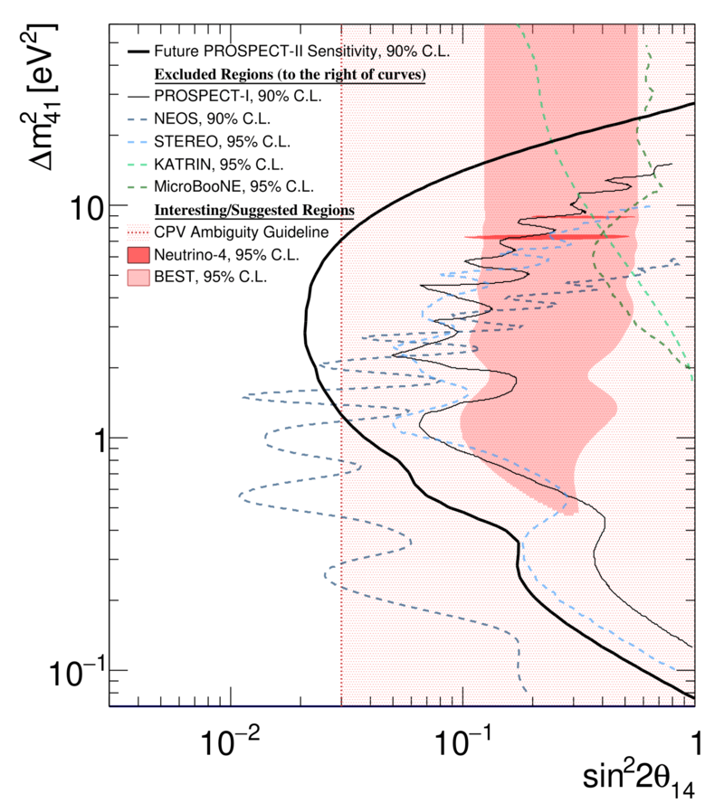

##### Abstract

The precision reactor oscillation and spectrum experiment, PROSPECT, has made world-leading measurements of reactor antineutrinos at short baselines. In its first phase, conducted at the high flux isotope reactor (HFIR) at Oak Ridge National Laboratory, PROSPECT produced some of the strongest limits on eV-scale sterile neutrinos, made a precision measurement of the reactor antineutrino spectrum from $^{235}$U, and demonstrated the observation of reactor antineutrinos in an aboveground detector with good energy resolution and well-controlled backgrounds. The PROSPECT collaboration is now preparing an upgraded detector, PROSPECT-II, to probe yet unexplored parameter space for sterile neutrinos and contribute to a full resolution of the reactor antineutrino anomaly, a longstanding puzzle in neutrino physics. By pressing forward on the world's most precise measurement of the 235U antineutrino spectrum and measuring the absolute flux of antineutrinos from 235U, PROSPECT-II will sharpen a tool with potential value for basic neutrino science, nuclear data validation, and nuclear security applications. Following a two-year deployment at HFIR, an additional PROSPECT-II deployment at a low enriched uranium reactor could make complementary measurements of the neutrino yield from other fission isotopes. PROSPECT-II provides a unique opportunity to continue the study of reactor antineutrinos at short baselines, taking advantage of demonstrated elements of the original PROSPECT design and close access to a highly enriched uranium reactor core.

---

##### Figure: Project PROSPECT-II sensitivity at 90% CL compared to other neutrino experiments. Interesting regions of oscillation parameter space are also shown.



---

##### Citation

```BibTeX
@article{PROSPECT:2021jey,
    author = "Andriamirado, M. and others",
    collaboration = "PROSPECT",
    title = "{PROSPECT-II physics opportunities}",
    eprint = "2107.03934",
    archivePrefix = "arXiv",
    primaryClass = "hep-ex",
    doi = "10.1088/1361-6471/ac48a4",
    journal = "J. Phys. G",
    volume = "49",
    number = "7",
    pages = "070501",
    year = "2022"
}

```

---